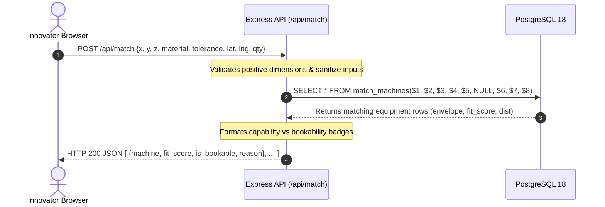
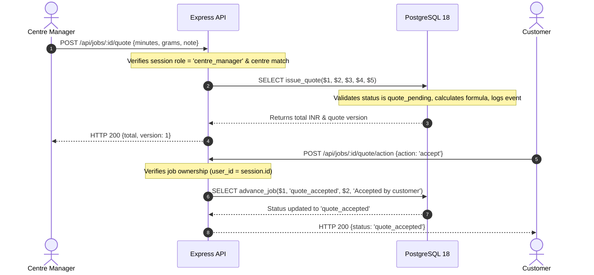

# APIC ProtoHub — Architecture Contract & System Design

**Version:** 1.0.0-ARCH  
**Status:** Canonical Architecture Specification  
**Architecture Style:** Modular Monolith with PostgreSQL Core

---

## 1. System Topology & Architectural Layers

APIC ProtoHub is structured as a three-tier modular monolith. The PostgreSQL database acts as the single source of truth for business invariants, pricing, and scheduling conflicts, while the application layer acts as an authenticated gateway.

```
┌────────────────────────────────────────────────────────────────────────┐
│                        TIER 1: PRESENTATION LAYER                      │
│                                                                        │
│   ┌─────────────────────┐  ┌─────────────────────┐  ┌──────────────┐   │
│   │ Innovator Hub       │  │ Manager Console     │  │ Staff Queue  │   │
│   │ (app.html)          │  │ (manager.html)      │  │ & Admin View │   │
│   └──────────┬──────────┘  └──────────┬──────────┘  └───────┬──────┘   │
│              │                        │                     │          │
│              └────────────────────────┼─────────────────────┘          │
│                                       │ HTTPS / JSON / Multipart       │
└───────────────────────────────────────┼────────────────────────────────┘
                                        │
                                        ▼ [TRUST BOUNDARY 1: Untrusted Network]
┌────────────────────────────────────────────────────────────────────────┐
│                     TIER 2: APPLICATION SERVICE LAYER                  │
│                               (Node.js / Express)                      │
│                                                                        │
│   ┌────────────────────────────────────────────────────────────────┐   │
│   │ Authentication & Scoping Middleware                            │   │
│   │ • Session Validator (Cookie/Bearer) • Centre Scoping Guard     │   │
│   └────────────────────────────────────────────────────────────────┘   │
│                                                                        │
│   ┌───────────────┐ ┌───────────────┐ ┌───────────────┐ ┌──────────┐   │
│   │ Matching      │ │ Jobs & Quotes │ │ Bookings      │ │ Inventory│   │
│   │ Service       │ │ Service       │ │ Service       │ │ Service  │   │
│   └───────────────┘ └───────────────┘ └───────────────┘ └──────────┘   │
│                                                                        │
│   ┌───────────────────────────────┐ ┌──────────────────────────────┐   │
│   │ Storage Adapter (Private Disk)│ │ Demo Adapters (OTP, Payments)│   │
│   └───────────────────────────────┘ └──────────────────────────────┘   │
└───────────────────────────────────────┼────────────────────────────────┘
                                        │
                                        ▼ [TRUST BOUNDARY 2: Protected Private IPC]
┌────────────────────────────────────────────────────────────────────────┐
│                      TIER 3: DATA & ENGINE LAYER                       │
│                     (PostgreSQL 18 - Port 5433)                        │
│                                                                        │
│   • schema.sql: Core Relational Model, Constraints, Views              │
│   • match.sql: match_machines(), free_slots()                          │
│   • manager.sql: advance_job(), issue_quote(), stock_movement          │
│   • GiST Exclusion Constraint on booking slots (Zero Double-Booking)   │
│   • Double-Entry Stock Movement Ledger with Non-Negative Trigger Guard │
└────────────────────────────────────────────────────────────────────────┘
```

---

## 2. Distinguishing Implemented Behavior vs. Proposed Design

To maintain strict architectural truthfulness, the table below delineates what currently exists in the codebase versus what is proposed:

| Architectural Component | Existing Implemented Behavior in Initial ZIP | Proposed Target Design |
|---|---|---|
| **Database Engine** | 5 SQL scripts (`schema.sql`, `match.sql`, `manager.sql`, `seed.sql`, `seed_jobs.sql`). | Dedicated local PostgreSQL instance running on port 5433 with numbered migrations (`db/migrations/`). |
| **API Layer** | Lightweight static Python server (`server.py`) serving files without database connectivity. | Modular Node.js/Express REST server (`server.js`) connecting via `pg` connection pool. |
| **Frontend State** | Frontends run purely in-memory using browser `localStorage` and `BroadcastChannel`. | Frontends fetch dynamic JSON from REST endpoints (`/api/*`) backed by the live database. |
| **File Storage** | Schema defines `job_file` table, but no file upload or storage implementation exists. | Local private filesystem adapter (`src/services/storage.js`) writing to `uploads/` with UUID keys. |
| **Authentication** | Users defined in `seed.sql`, but no session management or route authentication exists. | Session-based authentication with role-scoping middleware and 1-click Demo Persona Switcher. |
| **Double-Booking Prevention**| Implemented in `schema.sql` via GiST exclusion constraint. | Retained and verified through automated concurrency integration tests. |
| **State Machine** | Implemented in `manager.sql` (`advance_job`), but lacks row locking and quote status guards. | Enhanced with `FOR UPDATE` row locking, prior-state validation, and lifecycle reconciliation. |

---

## 3. Module Boundaries & Responsibilities

The application layer is partitioned into seven discrete modules:

### 3.1. Authentication & Session Module (`src/services/auth.js`)
- **Responsibilities:** Validates incoming session credentials, identifies the actor, resolves their assigned role (`innovator`, `centre_staff`, `centre_manager`, `apis_admin`) and facility (`centre_id`).
- **Trust Boundary:** Rejects any client-supplied `actor_id` or `centre_id`. Enforces personal and centre-level scoping.
- **Demo Mode:** Hosts the Persona Switcher allowing seamless role transitions during evaluation.

### 3.2. Capability Matching Module (`src/services/matching.js`)
- **Responsibilities:** Validates input part bounding dimensions ($X, Y, Z > 0$), calls `match_machines()`, calculates batch material requirements, formats snugness fit scores and distance, and separates physical capability from operational bookability.
- **Database Objects:** `match_machines()`, `centre`, `machine`, `machine_capability`, `machine_material`.

### 3.3. Job & Quotation Module (`src/services/jobs.js`)
- **Responsibilities:** Manages job work order creation, links uploaded CAD files, executes state transitions via `advance_job()`, and coordinates quotation authoring via `issue_quote()`.
- **Database Objects:** `job`, `quote`, `job_event`, `advance_job()`, `issue_quote()`.

### 3.4. Booking & Scheduling Module (`src/services/bookings.js`)
- **Responsibilities:** Projects available hourly slots via `free_slots()`, executes slot reservations with transactional GiST collision handling, and coordinates cancellations and rescheduling.
- **Database Objects:** `booking`, `free_slots()`, GiST exclusion index `booking_machine_id_slot_excl`.

### 3.5. Inventory Ledger Module (`src/services/inventory.js`)
- **Responsibilities:** Manages consumable inventory movements (`restock`, `adjustment`, `waste`), monitors low-stock alerts, and audits material usage.
- **Database Objects:** `stock_movement`, `machine_material`, `trg_stock_movement`, `v_material_alerts`.

### 3.6. Private Storage Module (`src/services/storage.js`)
- **Responsibilities:** Safely receives multipart CAD uploads (Multer), sanitizes filenames, generates collision-proof UUID storage keys, saves to private directory `uploads/`, and streams bytes to authorized users.
- **Database Objects:** `job_file`.

### 3.7. Administration & Reporting Module (`src/services/admin.js`)
- **Responsibilities:** Surfaces facility dashboard views (`v_manager_queue`, `v_centre_today`) and statewide network utilization analytics (`v_machine_utilization`).
- **Database Objects:** `v_manager_queue`, `v_centre_today`, `v_machine_utilization`.

---

## 4. End-to-End Request & Data Flows

### 4.1. Capability Matching Flow


### 4.2. Quoting & State Transition Flow


---

## 5. Trust Boundaries & Security Enclaves

```
[ UNTRUSTED ZONE: Browser Clients, Public Internet ]
                        │
                        ▼ (TLS, Origin Verification, Sanitization)
[ API GATEWAY ENCLAVE: Express Middleware ]
  • Role Verification (app_user.role)
  • Facility Scope Enforcement (centre_id matching)
  • Parameterized SQL Preparation
                        │
                        ▼ (Unix Domain Socket / Local IPC Port 5433)
[ SECURE CORE: PostgreSQL 18 Database Engine ]
  • GiST Exclusion Constraint Invariants
  • Negative Stock Invariant (CHECK in_stock_g >= 0)
  • Procedural State Machine Constraints (advance_job)
  • Immutable Audit Log (job_event, stock_movement)
```
