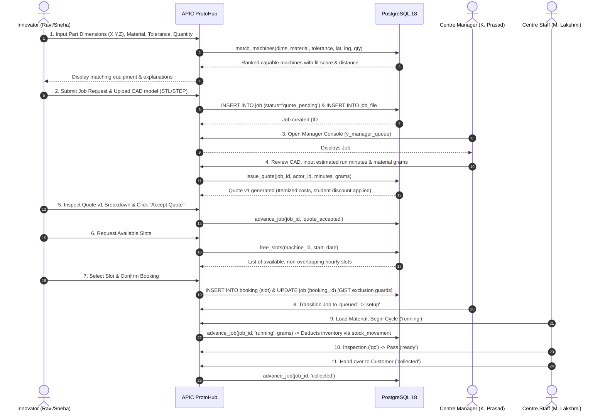

# APIC ProtoHub — Project Understanding & Architecture Brief

**Platform:** APIC ProtoHub (Prototyping-as-a-Service for Andhra Pradesh)  
**Authoring Context:** Lead Product Engineer & Solution Architect  
**Scope:** Canonical baseline understanding based on workspace inspection (`schema.sql`, `match.sql`, `manager.sql`, `seed.sql`, `seed_jobs.sql`, `app.html`, `manager.html`, `server.py`, runbooks, and concept notes).  
**Status:** Architecture Specification — No code or schema files have been altered.

---

## 1. Concise Product Understanding

The Andhra Pradesh Innovation Society (APIS) has funded and equipped advanced prototyping centres (APICs) across Andhra Pradesh (e.g., at AU Visakhapatnam, VR Siddhartha Vijayawada, SVU Tirupati, JNTU Kakinada, and JNTU Anantapur). These facilities contain high-capital equipment including industrial FDM 3D printers, SLA resin printers, SLS nylon printers, 3-axis CNC milling machines, CO2 laser cutters, and PCB prototyping plotters.

Despite significant capital expenditure, facilities remain underutilized because:
1. **Discoverability Failure:** Innovators, students, and startups lack visibility into which centres exist, what equipment they host, and whether a specific machine can manufacture their custom geometry.
2. **Capability Gap:** Traditional booking portals require users to select a machine make and model upfront. Non-specialist innovators know their part specifications (dimensions, material, precision, batch size), not machine taxonomy.
3. **Operational Silos:** Centre managers track jobs through disparate ad-hoc registers and manual phone follow-ups, with no automated pricing engine, real-time stock accounting, or schedule conflict resolution.
4. **State-Level Blind Spot:** APIS administrators have no centralized telemetry on machine utilization, downtime, regional demand, or subsidized student access.

**APIC ProtoHub** bridges this gap as a unified digital platform that operates as "Prototyping-as-a-Service". An innovator describes a part (bounding box $X \times Y \times Z$, material, tolerance, batch quantity); the core **capability matching engine** filters the statewide fleet by physical build envelope (accounting for 3D rotation), material compatibility, precision thresholds, and live material stock. The platform calculates transparent, itemized quotes (factoring in student subsidies), coordinates slot bookings with mathematical double-booking prevention, drives a strict multi-state job lifecycle from review to collection, and maintains an auditable double-entry stock ledger.

---

## 2. File-by-File Breakdown of the Source-of-Truth SQL Files

The baseline database layer comprises five PostgreSQL SQL scripts that define the data model, algorithms, operational state machine, and initial seed data.

```
schema.sql ──────► match.sql ──────► manager.sql ──────► seed.sql ──────► seed_jobs.sql
(Structure)        (Search Engine)   (Operations)        (Catalog Seed)   (Job State Seed)
```

### 2.1. `schema.sql` (Core Entities, Constraints, and Views)
`schema.sql` defines the structural backbone, indexing, and base analytical views.

- **Extensions:**
  - `CREATE EXTENSION IF NOT EXISTS btree_gist;` — Required to support composite GiST exclusion constraints pairing integer columns (`machine_id`) with range types (`TSTZRANGE`).

- **Centres & Identity (`centre`, `app_user`):**
  - `centre`: Represents an Andhra Pradesh prototyping workshop (`id`, `name`, `district`, `address`, `lat`, `lng`, `phone`, `opens_at`, `closes_at`, `working_days`, `is_live`, `created_at`). Defines operational parameters such as working hours (default `09:00` to `17:30`) and active ISO weekdays (default `{1,2,3,4,5,6}`). The `is_live` flag controls whether equipment is exposed to search.
  - `app_user`: Manages actors across the platform (`id`, `phone`, `name`, `email`, `role`, `centre_id`, `affiliation`, `institution`, `created_at`).
    - Roles: `innovator`, `centre_staff`, `centre_manager`, `apis_admin`.
    - Constraint `staff_needs_centre`: Enforces that `centre_staff` and `centre_manager` must have a non-null `centre_id`, while `innovator` and `apis_admin` can be unassigned.
    - Affiliations: `student`, `startup`, `industry`, `individual`, `institution`.

- **Equipment & Capabilities (`process`, `material`, `machine`, `machine_capability`, `machine_material`):**
  - `process`: Equipment categories (`code` PRIMARY KEY, `family`, `label`, `layman_label`). E.g., `fdm` ('Plastic 3D printing').
  - `material`: Raw material catalog (`code` PRIMARY KEY, `label`, `class`, `density_g_cm3`). E.g., `pla` with density `1.240 g/cm³`.
  - `machine`: Physical equipment units (`id`, `centre_id`, `process_code`, `make`, `model`, `asset_tag`, `status`, `rate_per_hour`, `setup_fee`, `min_charge`, `student_discount_pct`, `commissioned_on`). Status is constrained to `('available','in_use','maintenance','broken','retired')`. Unique on `(centre_id, asset_tag)`.
  - `machine_capability`: Technical manufacturing envelope (`machine_id` PRIMARY KEY, `max_x_mm`, `max_y_mm`, `max_z_mm`, `tolerance_mm`, `min_feature_mm`, `layer_min_mm`, `surface_finish`, `notes`).
  - `machine_material`: Association table (`machine_id`, `material_code` COMPOSITE PRIMARY KEY, `cost_per_gram`, `in_stock_g`, `reorder_at_g`). Tracks localized stock and pricing per machine.

- **Scheduling (`booking`):**
  - `booking`: Slot reservations (`id`, `machine_id`, `user_id`, `slot` TSTZRANGE, `status`, `is_block`, `block_reason`, `created_at`).
  - Exclusion Constraint:
    ```sql
    EXCLUDE USING gist (
        machine_id WITH =,
        slot WITH &&
    ) WHERE (status IN ('requested','confirmed'))
    ```
    Guarantees structural impossibility of double-booking an overlapping time range on the same machine when active.

- **Jobs & Quotes (`job`, `job_file`, `quote`, `job_event`):**
  - `job`: Core customer work order (`id`, `booking_id`, `user_id`, `machine_id`, `material_code`, `title`, `description`, `req_x_mm`, `req_y_mm`, `req_z_mm`, `req_tolerance_mm`, `quantity`, `status`, `created_at`).
    - Allowed statuses: `'draft'`, `'quote_pending'`, `'quote_sent'`, `'quote_accepted'`, `'queued'`, `'setup'`, `'running'`, `'qc'`, `'ready'`, `'collected'`, `'failed'`, `'cancelled'`.
  - `job_file`: Metadata for uploaded artifacts (`id`, `job_id`, `filename`, `storage_key`, `kind`, `bytes`, `uploaded_at`). Kind is constrained to `'model'`, `'drawing'`, `'gerber'`, `'photo'`, `'other'`.
  - `quote`: Itemized financial breakdown (`id`, `job_id`, `version`, `est_minutes`, `machine_cost`, `material_grams`, `material_cost`, `setup_cost`, `discount`, `total`, `source`, `prepared_by`, `valid_until`, `created_at`). Unique on `(job_id, version)`.
  - `job_event`: Immutable append-only audit trail (`id`, `job_id`, `from_status`, `to_status`, `note`, `actor_id`, `at`).

- **Base Analytical Views:**
  - `v_machine_utilization`: Aggregates weekly machine usage hours from confirmed/completed bookings and counts no-shows.
  - `v_material_alerts`: Flags stock where `in_stock_g <= reorder_at_g` to prevent job failures.

---

### 2.2. `match.sql` (Capability Matching & Scheduling Engine)
Contains two procedural PL/pgSQL functions:

1. `match_machines(p_x_mm, p_y_mm, p_z_mm, p_material, p_tolerance_mm, p_min_feature_mm, p_lat, p_lng, p_quantity)`:
   - **Dimension Sorting (Axis-Aligned Rotation):** Computes `d1 >= d2 >= d3` from inputs and `e1 >= e2 >= e3` from `machine_capability`. Enables matching even if the user inputs dimensions along different Cartesian axes.
   - **Haversine Distance:** Uses spherical trigonometry with Earth radius 6,371 km against `centre.lat` and `centre.lng`.
   - **Snugness Fit Score:** Evaluates $(d1/e1) \times (d2/e2) \times (d3/e3)$. A snugger fit scores higher, reserving larger machines for larger parts.
   - **Filters:** Filters out non-live centres, `retired` machines, parts exceeding envelope dimensions, incompatible materials, tolerance violations, and min-feature limits.

2. `free_slots(p_machine_id, p_from, p_days, p_slot_minutes)`:
   - Evaluates machine operating calendar by joining `centre.opens_at`, `centre.closes_at`, and `centre.working_days`.
   - Uses `generate_series` to project candidate slots over `p_days`.
   - Rejects candidate slots in the past (`c.s > now()`), slots extending past `closes_at`, and any slot overlapping active bookings (`status IN ('requested', 'confirmed')`).

---

### 2.3. `manager.sql` (Operations, Pricing, State Machine & Inventory Ledger)
Implements shop-floor workflows:

- **Double-Entry Stock Ledger (`stock_movement`):**
  - Columns: `id`, `machine_id`, `material_code`, `delta_g`, `reason`, `job_id`, `actor_id`, `note`, `at`.
  - Reason check: `'restock'`, `'job_consume'`, `'adjustment'`, `'waste'`, `'stocktake'`.
  - Trigger `trg_stock_movement` & Function `apply_stock_movement()`: Automatically updates `machine_material.in_stock_g = in_stock_g + NEW.delta_g`.

- **State Machine Advancement (`advance_job`):**
  - Validates permissible transitions:
    - `draft` $\rightarrow$ `quote_pending`
    - `quote_sent` $\rightarrow$ `quote_accepted`
    - `quote_accepted` $\rightarrow$ `queued`
    - `queued` $\rightarrow$ `setup`
    - `setup` $\rightarrow$ `running`
    - `running` $\rightarrow$ `qc`
    - `qc` $\rightarrow$ `ready`
    - `qc` $\rightarrow$ `running` (Rework loop)
    - `ready` $\rightarrow$ `collected`
    - Any active state $\rightarrow$ `failed`
    - Pre-run states $\rightarrow$ `cancelled`
  - Consumes material upon reaching `running` or `ready`, verifying available stock before inserting a `stock_movement` row.
  - Updates `job.status` and appends a record to `job_event`.

- **Quotation Pricing (`issue_quote`):**
  - Computes $\text{machine\_cost} = \text{ROUND}(\text{rate\_per\_hour} \times \text{minutes} / 60.0, 2)$.
  - Computes material cost using `machine_material.cost_per_gram \times p_grams`.
  - Applies `student_discount_pct` on machine time if user `affiliation = 'student'`.
  - Applies minimum charge floor: $\text{total} = \max(\text{machine\_cost} + \text{mat\_cost} + \text{setup\_fee} - \text{discount}, \text{min\_charge})$.
  - Increments version number, inserts into `quote`, updates job status to `'quote_sent'`, and logs to `job_event`.

- **Dashboard Views:**
  - `v_manager_queue`: Surfaces actionable jobs filtered by `status NOT IN ('draft','collected','cancelled','failed')`, prioritised by pending quotes (Priority 0) and today's schedule (Priority 1).
  - `v_centre_today`: Summarizes active jobs, awaiting quotes, pickups ready, today's bookings, and machines up/down for a centre manager.

---

### 2.4. `seed.sql` (Master Catalog Seed Data)
Provides initial operational data:
- **6 Processes:** `fdm`, `sla`, `sls`, `cnc_mill`, `laser_cut`, `pcb`.
- **9 Materials:** PLA, ABS, PETG, Nylon PA12, Standard Resin, Aluminium 6061, Acrylic, MDF, FR4.
- **5 Centres:** Visakhapatnam (live), Vijayawada (live), Tirupati (live), Kakinada (live), Anantapur (not live, `is_live = false`).
- **5 Demo Users:**
  - Ravi Teja (User 1, `innovator`, student, JNTU Kakinada)
  - Sneha Reddy (User 2, `innovator`, startup, HydroFilter Labs)
  - K. Prasad (User 3, `centre_manager`, Visakhapatnam)
  - M. Lakshmi (User 4, `centre_staff`, Vijayawada)
  - APIS Admin (User 5, `apis_admin`)
- **12 Machines & Capabilities:** Spread across the 5 centres with actual build volumes, tolerances, and hourly rates.
- **Machine-Material stocks:** Loaded inventory balances, including deliberate low-stock on machine 6 (Prusa MK4: 250g vs 500g threshold).
- **2 Sample Bookings:** Both on machine 1 (Ultimaker S5 at Vizag) for tomorrow.

---

### 2.5. `seed_jobs.sql` (Sample Work Orders & Event Histories)
Provides 5 sample jobs illustrating the lifecycle:
- **Job 1 (Ready):** Drone arm bracket, PLA, 4 units, Ultimaker S5. Fully priced (₹575.00), linked to booking 1, complete 8-event audit history.
- **Job 2 (Quote Sent):** Micro-fluidic test chip, resin, 2 units, Form 3L. Priced (₹1,140.00), linked to booking 2.
- **Job 3 (Quote Pending):** Sensor housing, PLA, 1 unit, Ultimaker S5. Awaiting pricing.
- **Job 4 (Running):** Jig plate, Al 6061, 1 unit, Haas Mini Mill. Priced (₹2,600.00), actively machining.
- **Job 5 (Quote Pending):** Gear prototype, PLA, 6 units, Ultimaker S5. Awaiting pricing.

---

## 3. Role and Permission Matrix

The platform enforces four distinct roles grounded in `app_user.role`:

| Feature / Operation | Innovator / Customer (`innovator`) | Centre Staff (`centre_staff`) | Centre Manager (`centre_manager`) | Network Administrator (`apis_admin`) |
|---|---|---|---|---|
| **Machine Discovery & Matching** | Public / Authenticated | Authenticated | Authenticated | Full Access |
| **View Machine & Material Catalog** | Public (Live centres only) | Scoped to own centre + global | Scoped to own centre + global | Full Access across all centres |
| **Submit Job Request & Upload Files** | Yes (Own jobs only) | No (Operational role) | No (Operational role) | Can submit on behalf |
| **View Job Details & CAD Files** | Own jobs only | Centre-assigned jobs only | Centre-assigned jobs only | Network-wide audit access |
| **Issue / Revise Quotation** | No | Read-only | Yes (Centre-assigned jobs) | Yes (All centres) |
| **Accept / Decline Quotation** | Yes (Own jobs only) | No | No | No |
| **Book Free Slot** | Yes (For accepted quotes) | Staff override / assisted | Yes | Full override |
| **Reschedule / Cancel Booking** | Yes (Subject to rules) | Centre-assigned only | Centre-assigned only | Full Access |
| **Advance Job Status** | Cancel / Accept quote only | Setup $\rightarrow$ Running $\rightarrow$ QC $\rightarrow$ Ready | Full state machine control | Full state machine control |
| **Record Stock Movement** | No | Rework / Scrap consumption | Restock, adjust, waste | Full audit & network ledger |
| **Manage Machine Status** | No | View / report issue | Set available / maint. / broken | Create, decommission, edit |
| **Centre Onboarding / Settings** | No | No | Update hours / contact | Toggle `is_live`, create centres |
| **Analytics & Utilization Reports** | Personal history only | Today's centre queue | Centre dashboard & queue | Statewide `v_machine_utilization` |

---

## 4. Plain-Language End-to-End Workflow



---

## 5. List of Known and Newly Discovered Defects

Every defect has been verified against the physical SQL files in the workspace:

### Defect 1: Cross-Machine Booking Data Inconsistency in Seed
- **File & Reference:** `seed.sql:98` and `seed_jobs.sql:13`.
- **Finding:** In `seed.sql`, booking ID 2 is inserted on machine 1 (`Ultimaker S5`). In `seed_jobs.sql`, Job 2 is inserted with `booking_id = 2`, but `machine_id = 2` (`Formlabs Form 3L`).
- **Impact:** Contradictory relationship. The job claims to be scheduled on machine 2, but its booking locks machine 1.
- **Root Cause:** Missing composite foreign key constraint in `schema.sql`.

### Defect 2: Missing Composite Foreign Key on Job Booking
- **File & Reference:** `schema.sql:145`.
- **Finding:** `job.booking_id` has `REFERENCES booking(id)`, but does not enforce matching `machine_id` or `user_id`.
- **Impact:** Any user could link a booking belonging to someone else or on an entirely different machine to their job.

### Defect 3: `issue_quote()` Bypasses State Machine & Mislogs Event Status
- **File & Reference:** `manager.sql:140-188`.
- **Finding:**
  1. `issue_quote()` does not validate the job's current status. A manager can issue a quote for a job that is already `ready`, `collected`, `running`, or `cancelled`.
  2. In `SELECT ... j.status INTO v_machine`, the variable `v_machine` holds the status, but line 186 executes `INSERT INTO job_event (job_id, from_status, ...) VALUES (p_job_id, v_machine.status, 'quote_sent', ...)`. If multiple columns called `status` are joined without explicit naming, it risks logging machine status rather than prior job status.
- **Impact:** Corrupts job lifecycle history and violates state machine invariants.

### Defect 4: Unauthenticated Actor Parameters in Manager Operations
- **File & Reference:** `manager.sql:51, 125`.
- **Finding:** Functions `advance_job(..., p_actor BIGINT)` and `issue_quote(..., p_actor BIGINT)` take `p_actor` blindly. There is no verification that `p_actor` belongs to the centre hosting the machine or has the required role.
- **Impact:** Critical authorization bypass if browser-supplied IDs are forwarded to SQL functions without server validation.

### Defect 5: Missing Check Constraint for Negative Inventory
- **File & Reference:** `schema.sql:107` and `manager.sql:30-43`.
- **Finding:** Table `machine_material` has `in_stock_g NUMERIC(10,2) NOT NULL DEFAULT 0`, but lacks `CHECK (in_stock_g >= 0)`. The trigger `apply_stock_movement` unconditionally applies `in_stock_g = in_stock_g + NEW.delta_g`.
- **Impact:** A negative `delta_g` movement can plunge inventory balances below zero.

### Defect 6: Concurrency Race Condition in `advance_job` Stock Deduction
- **File & Reference:** `manager.sql:98-109`.
- **Finding:** In `advance_job`, the stock check query `SELECT in_stock_g INTO v_have FROM machine_material WHERE ...` does not use `FOR UPDATE`.
- **Impact:** Two concurrent jobs attempting to start on the same material will both see sufficient stock, both proceed, and cause negative stock or phantom inventory allocation.

### Defect 7: Disconnected Lifecycles for Jobs and Bookings
- **File & Reference:** `schema.sql:123, 158` and `manager.sql:51`.
- **Finding:** When a job is cancelled (`advance_job(..., 'cancelled')`), the linked `booking` remains `confirmed` or `requested`. The GiST exclusion constraint continues to block that slot from other innovators indefinitely.
- **Impact:** "Ghost reservations" preventing machine utilization.

### Defect 8: `match_machines` Accepts `p_quantity` but Never Evaluates It
- **File & Reference:** `match.sql:16, 125`.
- **Finding:** `p_quantity INT DEFAULT 1` is defined in `match_machines()`, but the filter condition on line 125 only checks `AND (p_material IS NULL OR mm.in_stock_g > 0)`.
- **Impact:** A batch of 100 parts will match a machine holding only 10 grams of material.

### Defect 9: Non-Operational Machines Returned as Matching Options
- **File & Reference:** `match.sql:113, 128`.
- **Finding:** Filter `WHERE m.status <> 'retired'` allows machines with status `maintenance`, `broken`, and `in_use` into matching results.
- **Impact:** Users are shown broken equipment with no separation between physical capability and immediate bookability.

### Defect 10: Premature Booking in Seed Job 2
- **File & Reference:** `seed_jobs.sql:11-14`.
- **Finding:** Job 2 has `status = 'quote_sent'`, but references `booking_id = 2`.
- **Impact:** In the platform lifecycle, an innovator cannot book an appointment before reviewing and accepting the quotation.

---

## 6. Assumptions, Ambiguities, and Product Decisions

| Item | Context | Status / Assumption | Product Decision Needed |
|---|---|---|---|
| **Booking Timing vs. Quote Acceptance** | Can an innovator pick a tentative slot before quote issuance, or strictly after quote acceptance? | **Assumed:** Quote must be accepted before slot booking is confirmed. | Confirm if tentative slot holding is permitted during quote review. |
| **Material Usage by Weight Estimation** | `job` stores dimensions $X, Y, Z$, but CAD models are not solid prisms (infill varies from 15% to 100%). | **Assumed:** Matching estimates raw stock requirement using bounding volume $\times$ material density $\times$ average infill factor (0.35). | Confirm bounding box volume estimation factor for pre-CAD validation. |
| **Subsidized Pricing Eligibility** | `app_user.affiliation` defines `'student'`. | **Assumed:** Student discount applies strictly to hourly machine rates, not raw materials or setup fees. | Confirm if institutional subsidies apply to consumables. |
| **File Storage Strategy** | `job_file` stores `storage_key`. | **Assumed:** Private local filesystem storage adapter for local demo (`uploads/`), swappable with S3/GCS. | Confirm file size limits (e.g., 50MB) and allowed extensions (`.stl`, `.step`, `.dxf`, `.pdf`). |
| **Timezone Standard** | PostgreSQL timestamps in `booking` and `job_event`. | **Assumed:** Indian Standard Time (`Asia/Calcutta`, UTC+05:30). | Ensure all timestamps and slot calculations explicitly operate in IST. |

---

## 7. Proposed Modular Architecture & Recommended Stack

Based on workspace inspection, the repository contains Python HTTP utilities (`server.py`), HTML interfaces (`app.html`, `manager.html`), and a package environment with Node.js 24, PostgreSQL 18.6, `pg`, `dotenv`, `express`, and `multer`.

To ensure maximum reliability without external build friction, the recommended architecture is a **modular Node.js monolith**:

```
┌────────────────────────────────────────────────────────────┐
│                    Browser Client Layer                    │
│   • Innovator Portal (app.html)                            │
│   • Centre Manager Console (manager.html)                  │
│   • Staff Floor Queue & Admin Statewide Portal             │
│   • Unified Demo Switcher & Session Provider               │
└─────────────────────────────┬──────────────────────────────┘
                              │ HTTP / REST APIs
                              ▼
┌────────────────────────────────────────────────────────────┐
│                  Server Layer (Node.js/Express)            │
│                                                            │
│   ┌────────────────────────────────────────────────────┐   │
│   │ Auth & Session Middleware (Role & Centre Scoping)  │   │
│   └────────────────────────────────────────────────────┘   │
│                                                            │
│   ┌──────────────────┐ ┌──────────────────┐ ┌───────────┐  │
│   │ Matching Service │ │ Jobs & Quotes    │ │ Inventory │  │
│   └──────────────────┘ └──────────────────┘ └───────────┘  │
│   ┌──────────────────┐ ┌──────────────────┐ ┌───────────┐  │
│   │ Booking Service  │ │ File Storage     │ │ Admin     │  │
│   └──────────────────┘ └──────────────────┘ └───────────┘  │
└─────────────────────────────┬──────────────────────────────┘
                              │ Parameterized SQL Pool (pg)
                              ▼
┌────────────────────────────────────────────────────────────┐
│            PostgreSQL 18 Database Engine (Port 5433)       │
│   • Core Schema & Integrity Constraints                    │
│   • btree_gist Exclusion Constraint on Bookings            │
│   • Procedural Engines: match_machines, free_slots         │
│   • Double-Entry Stock Movement Ledger & Triggers          │
└────────────────────────────────────────────────────────────┘
```

---

## 8. Prioritized Risk Register

| Risk ID | Category | Description | Severity | Mitigation Strategy |
|---|---|---|---|---|
| **R-01** | **Security** | Insecure direct object reference (IDOR) on uploaded CAD files. Proprietary startup designs exposed. | **CRITICAL** | Route file downloads through authenticated endpoint verifying `job.user_id = session.user_id` or centre assignment. |
| **R-02** | **Security** | Role spoofing and centre impersonation via client-supplied `actor_id`. | **CRITICAL** | Derive `actor_id` and assigned `centre_id` strictly from server-verified session; reject unauthenticated actor IDs. |
| **R-03** | **Data Integrity** | Slot collision under concurrent booking requests. | **HIGH** | Retain PostgreSQL GiST exclusion constraint (`slot && WITH machine_id =`). Wrap booking creation in serializable transactions. |
| **R-04** | **Data Integrity** | Inventory balance drops below zero via race conditions in job runs. | **HIGH** | Add `CHECK (in_stock_g >= 0)` constraint and execute `SELECT ... FOR UPDATE` row locking during stock consumption. |
| **R-05** | **Usability** | Innovator travels to centre only to find machine under maintenance. | **MEDIUM** | Separate physical capability from operational status in `match_machines`. Flag maintenance status prominently. |
| **R-06** | **Demo Reliability**| Accidental reset in a staging/production database containing real data. | **HIGH** | Guard database reset endpoint (`/api/system/reset`) with strict environment checks (`NODE_ENV === 'demo'`). |

---

## 9. Glossary of Domain Terms

- **APIC (Andhra Pradesh Innovation Centre):** Government-funded prototyping workshop hosting high-capital manufacturing equipment.
- **APIS (Andhra Pradesh Innovation Society):** Nodal government agency overseeing innovation and entrepreneurship across the state.
- **Build Envelope ($X \times Y \times Z$):** The maximum physical working volume (in millimetres) that a machine can accommodate.
- **Axis-Aligned Rotation:** Comparing sorted part dimensions ($d_1 \ge d_2 \ge d_3$) against sorted envelope dimensions ($e_1 \ge e_2 \ge e_3$) to evaluate 3D fit regardless of input orientation.
- **GiST Exclusion Constraint:** A PostgreSQL indexing constraint using Generalized Search Tree to prevent overlapping intervals (`TSTZRANGE`) on the same foreign key (`machine_id`).
- **Snugness Fit Score:** The ratio of part volume to build envelope volume. Higher scores indicate the part efficiently fills the machine, preserving larger machines for larger workpieces.
- **Double-Entry Stock Ledger:** Accounting model where inventory is never mutated in place; every addition or subtraction is an immutable transaction record (`stock_movement`).

---

## 10. List of Artifacts to Maintain

1. `docs/PROJECT_UNDERSTANDING.md` — This architectural baseline.
2. `docs/SQL_AUDIT.md` — Deep correctness audit of all schema, constraint, trigger, and procedural objects.
3. `docs/PRODUCT_SPEC.md` — Canonical functional requirements and business rules.
4. `docs/ROLE_PERMISSION_MATRIX.md` — Exhaustive access control matrix with centre scoping rules.
5. `docs/DECISIONS.md` — Architectural Decision Records (ADRs) and open questions.
6. `docs/IMPLEMENTATION_PLAN.md` — Step-by-step phased execution plan with testable gates.
7. `AGENTS.md` — Persistent instructions and development guardrails for AI coding sessions.
8. `docs/ARCHITECTURE.md` — Module boundaries, data flow diagrams, and trust perimeters.
9. `docs/API_CONTRACT.md` — OpenAPI/REST contract with request/response schemas.
10. `docs/STATE_MACHINES.md` — Formal transition graphs for jobs, bookings, quotes, and machines.
11. `docs/DEMO_MODE.md` — Specification for mock adapters, seeded accounts, and reset procedures.
12. `docs/TEST_STRATEGY.md` — Test pyramid covering unit, database concurrency, security, and E2E journeys.

---

## 11. Summary: What I Understand vs. What Remains Unknown

### What I Understand (Confirmed Facts):
- The five source SQL files provide a sound data model and business logic core that was previously validated conceptually.
- Double-booking prevention via PostgreSQL GiST exclusion is structurally sound if preserved.
- The state machine in `manager.sql` covers standard prototyping workflows, but has critical validation gaps around `issue_quote()` and stock row locking.
- Existing frontend files (`app.html`, `manager.html`) were designed to match the exact schema column names, but currently run on disconnected browser `localStorage`.
- All 10 identified defects have been verified directly in the SQL source code.

### What Remains Unknown (Pending User / Stakeholder Input):
- Exact business rules for tentative vs. confirmed slot reservation before quote acceptance.
- Standard payment gateway integration plans (assumed mock demo adapter for phase 1).
- Long-term object storage target (AWS S3 vs. Azure Blob vs. self-hosted MinIO).
