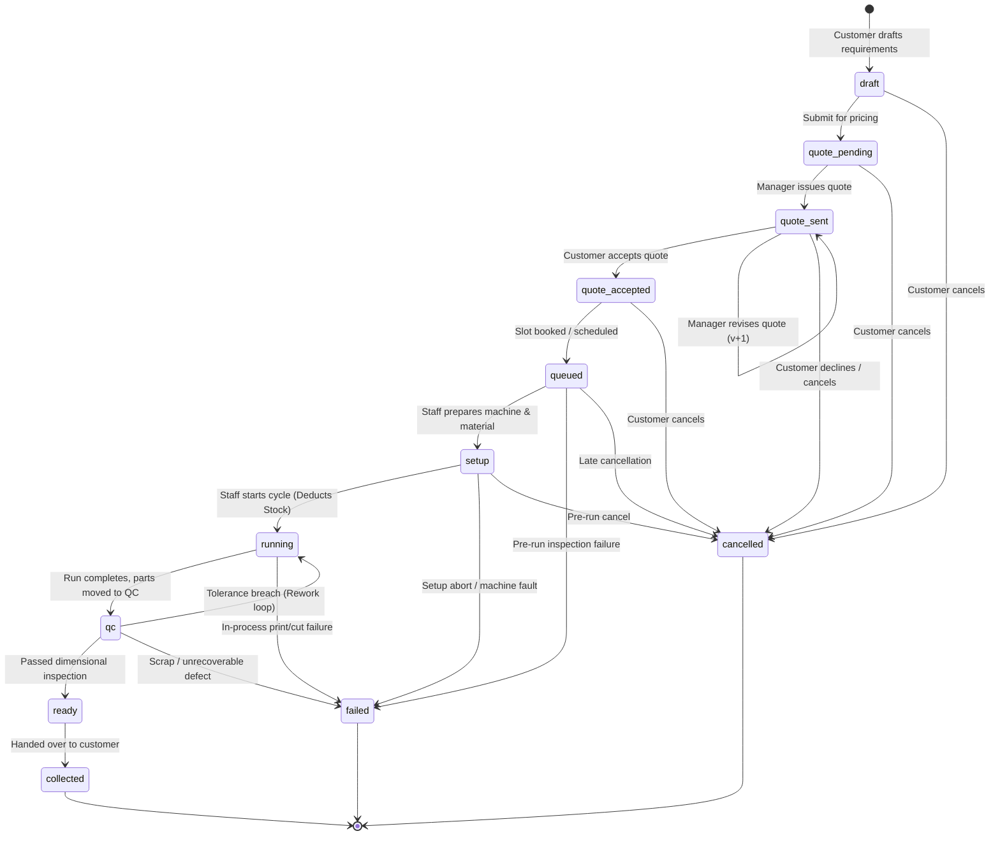
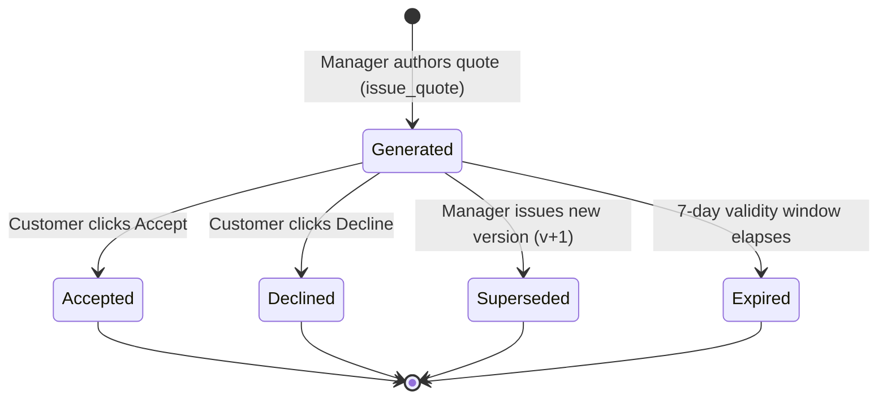
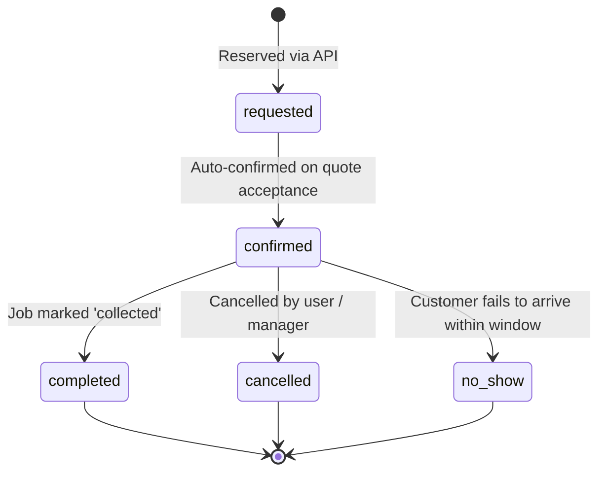
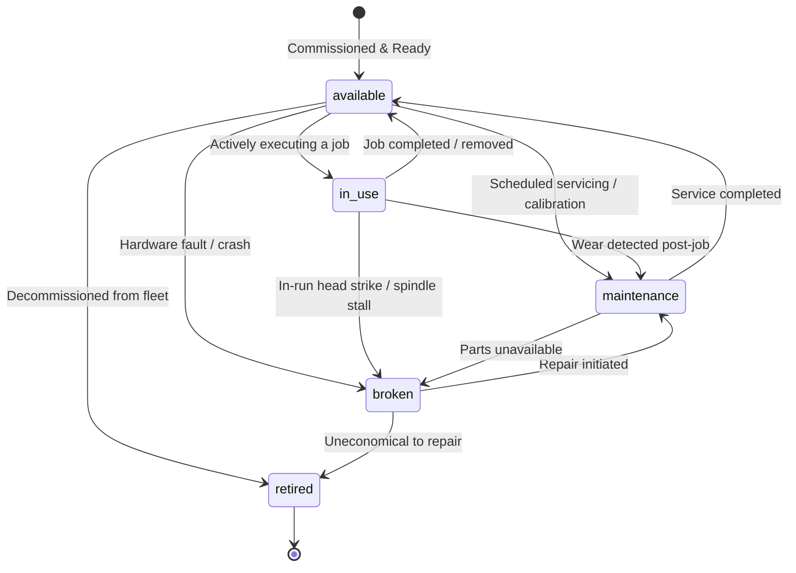

# APIC ProtoHub — Canonical State Machine Specifications

**Version:** 1.0.0-STM  
**Scope:** Formal Transition Graphs, Invariants, and Side-Effects for Work Orders, Quotations, Bookings, and Machines.  
**Source of Truth:** PostgreSQL Functions (`advance_job()`, `issue_quote()`) and Table Constraints.

---

## 1. Job Lifecycle State Machine

The core job lifecycle controls the manufacturing progression from digital inquiry to physical part collection.

### 1.1. Transition Invariants & Side Effects Table

| From Status | To Status | Trigger / Action | Authorized Actors | Side Effects & Invariants |
|---|---|---|---|---|
| `draft` | `quote_pending` | Customer submits job request | `innovator`, `apis_admin` | Requires valid dimensions, material, and quantity. Logs `job_event`. |
| `quote_pending` | `quote_sent` | Manager issues itemized quote | `centre_manager`, `apis_admin` | Generates immutable `quote` row. Prior status must be `quote_pending` or `quote_sent`. |
| `quote_sent` | `quote_accepted` | Customer accepts quote version | `innovator` (Owner only) | Locks quote price. Enables slot booking. |
| `quote_accepted`| `queued` | Customer/Manager books slot | `innovator`, `centre_manager` | Requires valid `booking_id` matching machine and user. |
| `queued` | `setup` | Staff initiates machine setup | `centre_staff`, `centre_manager` | Staff inspects CAD file, cleans bed, checks tools. |
| `setup` | `running` | Physical machine run begins | `centre_staff`, `centre_manager` | **CRITICAL SIDE EFFECT:** Locks `machine_material` (`FOR UPDATE`), verifies sufficient stock, inserts negative `stock_movement`. Aborts if stock insufficient. |
| `running` | `qc` | Machine completes cycle | `centre_staff`, `centre_manager` | Part removed, cleaned, and queued for dimensional measurement. |
| `qc` | `ready` | Part passes QC inspection | `centre_staff`, `centre_manager` | QC notes recorded. Part placed on pickup shelf. Innovator notified. |
| `qc` | `running` | **Rework Loop:** QC failure | `centre_staff`, `centre_manager` | Rework note logged. Additional material consumed if required. |
| `ready` | `collected` | Innovator picks up part | `centre_staff`, `centre_manager` | Reconciles linked booking to `'completed'`. Job reaches terminal state. |
| Active Pre-Run | `cancelled` | Cancellation before run | `innovator`, `centre_manager` | **LIFECYCLE RECONCILIATION:** Automatically sets linked booking to `'cancelled'`, freeing slot in `free_slots()`. |
| Active Run | `failed` | Machine crash / fatal fault | `centre_staff`, `centre_manager` | Failure note logged. Stock consumed is not refunded unless scrap adjustment is logged. |

---

## 2. Quotation Lifecycle State Machine

Quotes are versioned line-item records governed by `quote`:

### 2.1. Quotation Rules:
1. **Append-Only Immutability:** Existing quote records are never modified in place. Any price adjustment requires creating version $v+1$.
2. **Formula Integrity:** Machine cost, material cost, setup fee, and student discounts are verified to the paisa. Subtotals cannot drop below `machine.min_charge`.
3. **Validity Expiration:** Unaccepted quotes expire after `valid_until` (default: 7 days). Expired quotes cannot be accepted without re-issuance.

---

## 3. Booking & Slot State Machine

Governed by table `booking` and protected by GiST exclusion:

### 3.1. Booking Rules:
1. **Exclusion Guard:** A booking in status `'requested'` or `'confirmed'` holds a physical lock on the machine build envelope for `slot`. No overlapping booking can be inserted.
2. **Exclusion Release:** Transitioning to `'cancelled'` immediately releases the GiST lock, allowing the slot to appear in `free_slots()`.
3. **No-Show Handling:** Transitioning to `'no_show'` retains the historical record for APIS utilization reports while flagging customer accounts.

---

## 4. Machine Operational State Machine

Governed by `machine.status`:

### 4.1. Operational Rules:
1. **Search Surface Visibility:** Only machines with `status <> 'retired'` appear in matching queries.
2. **Bookability Separation:** Only machines with `status = 'available'` and located at live centres (`centre.is_live = true`) return `is_bookable = TRUE`.
3. **Maintenance Blocking:** When a machine transitions to `'maintenance'` or `'broken'`, any pending requested bookings trigger rescheduling alerts in the manager console.
