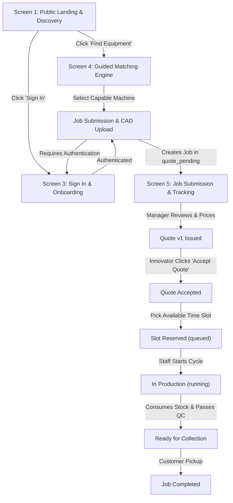

# APIC ProtoHub — Stitch UI Design Handoff & Screen Inventory

**Project Source:** Google Stitch MCP (`projects/5633555568263663967`)  
**Design System Name:** `Blueprint Precision`  
**Color Profile:** Corporate Modernism with Industrial Blueprint Utility  
**Typography:** Inter (Tabular figures `tnum`, 8-point base module, 4-point micro density)  
**Status:** Assets and HTML Successfully Retrieved & Saved Locally in `docs/stitch_designs/`

---

## 1. Master Design System Tokens

The Stitch project defines the canonical `Blueprint Precision` design language, optimized for high-density engineering validation, shop-floor readability, and clear state gating:

### 1.1. Color Tokens (`tailwind.config.js` extension)
```javascript
colors: {
  // Primary Engineering Driver
  primary: '#0037b0',
  'primary-container': '#1d4ed8',     // Cobalt action buttons, active tabs
  'on-primary': '#ffffff',
  'on-primary-container': '#cad3ff',

  // Secondary Institutional Authority
  secondary: '#445e8f',
  'secondary-container': '#adc7fe',
  'on-secondary': '#ffffff',

  // Tertiary Telemetry & Precision
  tertiary: '#004e47',
  'tertiary-container': '#00685f',     // Precision Teal (#0D9488) for live status / verified
  'on-tertiary': '#ffffff',

  // Neutral Industrial Canvas & Slate Surfaces
  surface: '#f8f9ff',
  'surface-dim': '#cbdbf5',
  'surface-bright': '#f8f9ff',
  'surface-container-lowest': '#ffffff', // High-density cards, data tables
  'surface-container-low': '#eff4ff',
  'surface-container': '#e5eeff',        // Sub-panel nests, inactive headers
  'surface-container-high': '#dce9ff',
  'surface-container-highest': '#d3e4fe',
  'on-surface': '#0b1c30',              // High-contrast ink primary
  'on-surface-variant': '#434655',      // Secondary technical labels
  outline: '#747686',
  'outline-variant': '#c4c5d7',         // Hairline borders

  // Operational State Accents
  amber: '#d97706',                      // In-queue / calibration / quote pending
  error: '#ba1a1a',                      // Machine stops / cancellations / errors
  'error-container': '#ffdad6',
  'on-error': '#ffffff',
}
```

### 1.2. Typography Hierarchy
- **Font Family:** `Inter`, sans-serif (with tabular figures `font-mono` / `tnum` for dimensions and currency).
- **Scales:**
  - `display-lg`: 48px / 56px (Desktop hero)
  - `headline-xl`: 36px / 44px (Major section headings)
  - `headline-lg`: 28px / 36px (Panel headers)
  - `headline-md`: 22px / 30px (Card titles)
  - `headline-sm`: 18px / 26px (Modal & sub-section titles)
  - `body-lg`: 16px / 26px (Lead copy)
  - `body-md`: 14px / 22px (Standard controls and table text)
  - `body-sm`: 13px / 20px (Compact metadata)
  - `label-md`: 12px / 16px (Field labels, uppercase with `0.04em` tracking)
  - `label-sm`: 11px / 14px (Badges and category eyebrows with `0.05em` tracking)
  - `code-md`: 13px / 18px (Technical coordinates, machine tags, order numbers)

### 1.3. Geometry & Radii
- `rounded`: `0.25rem` (4px) — Standard for form inputs, buttons, and status tags.
- `rounded-lg`: `0.5rem` (8px) — Group containers, cards, and modal dialogs.
- `rounded-none`: `0px` — Analytical data matrices and blueprint previews.

---

## 2. Screen Inventory & Asset Mapping

All screens were extracted directly from the Stitch MCP service and saved with their full HTML, JSON specifications, and high-resolution PNG renders:

| Screen # | Screen Title | Screen ID | Local HTML Asset | Visual Preview Asset | Target Persona & Role |
|---|---|---|---|---|---|
| **1** | **Public Landing & Discovery** | `81605e15cdd0467890fed5534ff44a52` | [`docs/stitch_designs/apic_protohub_public_landing_discovery.html`](file:///c:/Users/DELL/Downloads/APIC_ProtoHub_Complete_Package/docs/stitch_designs/apic_protohub_public_landing_discovery.html) | [`.../apic_protohub_public_landing_discovery.png`](file:///c:/Users/DELL/Downloads/APIC_ProtoHub_Complete_Package/docs/stitch_designs/apic_protohub_public_landing_discovery.png) | Public / Unauthenticated Innovator |
| **2** | **Design System & Component Tokens** | `5baa62a5baba480f97998c2a3e23f803` | [`docs/stitch_designs/apic_protohub_design_system_tokens.html`](file:///c:/Users/DELL/Downloads/APIC_ProtoHub_Complete_Package/docs/stitch_designs/apic_protohub_design_system_tokens.html) | [`.../apic_protohub_design_system_tokens.png`](file:///c:/Users/DELL/Downloads/APIC_ProtoHub_Complete_Package/docs/stitch_designs/apic_protohub_design_system_tokens.png) | Shared Pattern Library across all roles |
| **3** | **Sign In & Onboarding** | `43f6de41440c447e88703373a16dd612` | [`docs/stitch_designs/apic_protohub_sign_in_onboarding.html`](file:///c:/Users/DELL/Downloads/APIC_ProtoHub_Complete_Package/docs/stitch_designs/apic_protohub_sign_in_onboarding.html) | [`.../apic_protohub_sign_in_onboarding.png`](file:///c:/Users/DELL/Downloads/APIC_ProtoHub_Complete_Package/docs/stitch_designs/apic_protohub_sign_in_onboarding.png) | Customer Onboarding (Student / Startup) |
| **4** | **Guided Machine Matching Engine** | `c0d5bf8dcacb4570a020796fb30073bf` | [`docs/stitch_designs/apic_protohub_guided_machine_matching_engine.html`](file:///c:/Users/DELL/Downloads/APIC_ProtoHub_Complete_Package/docs/stitch_designs/apic_protohub_guided_machine_matching_engine.html) | [`.../apic_protohub_guided_machine_matching_engine.png`](file:///c:/Users/DELL/Downloads/APIC_ProtoHub_Complete_Package/docs/stitch_designs/apic_protohub_guided_machine_matching_engine.png) | Innovator Search & DFM Verification |
| **5** | **Job Submission, Quotes & Live Tracking** | `71982626c43841b6815f5b34a7a7f718` | [`docs/stitch_designs/apic_protohub_job_submission_quotes_live_tracking.html`](file:///c:/Users/DELL/Downloads/APIC_ProtoHub_Complete_Package/docs/stitch_designs/apic_protohub_job_submission_quotes_live_tracking.html) | [`.../apic_protohub_job_submission_quotes_live_tracking.png`](file:///c:/Users/DELL/Downloads/APIC_ProtoHub_Complete_Package/docs/stitch_designs/apic_protohub_job_submission_quotes_live_tracking.png) | Customer Job Tracking & Staff Execution |

---

## 3. Screen-by-Screen Behavioral Specification & API Binding

### 3.1. Screen 1: Public Landing & Discovery (`apic_protohub_public_landing_discovery.html`)
- **Key Sections:**
  - Header with wordmark, active facility status indicator (`sensors` pulse), and "Launch Innovator Hub" CTA.
  - Value proposition blocks: Geometry Matching, Transparent Quoting, Collision-Proof Scheduling, Government Subsidies.
  - Network overview cards showing 5 APIC centres (AU Visakhapatnam, VR Siddhartha Vijayawada, SVU Tirupati, JNTU Kakinada, JNTU Anantapur) with active equipment counts.
- **API Data Binding:**
  - Reads `GET /api/admin/centres` to display live operational facilities.
  - Navigation CTA routes to Sign In or Matching Engine.

### 3.2. Screen 3: Sign In & Onboarding (`apic_protohub_sign_in_onboarding.html`)
- **Key Sections:**
  - Phone OTP / Email authentication tab toggle.
  - Interactive OTP verification modal with simulated demo badge: `"Simulated in local demo mode — no external network SMS sent"`.
  - Onboarding form: Full Name, Affiliation selector (`Student`, `Startup`, `Industry`, `Individual`, `Institution`), and Academic/Company Institution text field.
  - Quick Persona Switcher buttons for instant demo evaluation (Ravi Teja, Sneha Reddy, K. Prasad, M. Lakshmi, APIS Admin).
- **API Data Binding:**
  - `POST /api/auth/otp/send` $\rightarrow$ Generates test OTP token.
  - `POST /api/auth/otp/verify` $\rightarrow$ Authenticates and binds HTTP-only session cookie.
  - `POST /api/auth/switch-persona` $\rightarrow$ Instantly switches demo session to target user.

### 3.3. Screen 4: Guided Machine Matching Engine (`apic_protohub_guided_machine_matching_engine.html`)
- **Key Sections:**
  - **Part Requirements Profile Form (Step 1 of 2):**
    - Fabrication Modality selector chips (`CNC Machining`, `DMLS/SLS Additive`, `FDM 3D Printing`, `Laser Cutting`, `PCB Prototyping`).
    - Material Specification dropdown with `"Certified Stock"` indicator.
    - Bounding Dimensions Matrix ($X \times Y \times Z\text{ mm}$) with fixed trailing unit sub-boxes.
    - Batch Quantity and Precision Tolerance ($\pm\text{ mm}$) selectors.
  - **Live Matching Results Grid:**
    - Snugness Fit Score gauge ($(d_1/e_1) \times (d_2/e_2) \times (d_3/e_3)$).
    - Separation of Physical Capability vs. Operational Bookability (e.g., `"Capable • In Maintenance"` vs. `"Capable • Ready to Book"`).
    - Distance in km calculated via Haversine formula against selected user coordinates.
    - Indicative hourly rate and setup fee breakdown.
    - Action button: `"Select Machine & Submit CAD"` $\rightarrow$ Opens Job Submission.
- **API Data Binding:**
  - Form submit triggers `POST /api/match` with payload `{x_mm, y_mm, z_mm, material, tolerance_mm, quantity, lat, lng}`.
  - Real-time renders rows returned by PostgreSQL `match_machines()`.

### 3.4. Screen 5: Job Submission, Quotes & Live Tracking (`apic_protohub_job_submission_quotes_live_tracking.html`)
- **Key Sections:**
  - **4-Stage Progress Stepper:**
    1. `CAD DFM` (Verified)
    2. `Tariff / Quote` (Priced & Approved)
    3. `Fabrication` (Setup $\rightarrow$ Running)
    4. `Metrology & Collection` (QC $\rightarrow$ Ready $\rightarrow$ Collected)
  - **CAD Specification Card:** File name, size, SHA-256 integrity hash, bounding envelope verification.
  - **Itemized Tariff / Quotation Inspector:**
    - Machine run time cost ($\text{rate} \times \text{minutes} / 60$)
    - Consumable raw material mass ($\text{grams} \times \text{cost/g}$)
    - Fixed setup fee
    - Student subsidy discount (50% applied to machine time)
    - Total payable in ₹ (INR)
    - Actions: `"Accept Quote"` (triggers transition to `quote_accepted`) or `"Decline"`.
  - **Live Production Telemetry & Slot Booking:**
    - Available hourly slots selector populated from `free_slots()`.
    - Real-time layer progress bar (e.g., `Layer 64%`, spindle RPM, hotend temperature).
  - **Granular Event History Timeline:**
    - Real-time audit log pulled from `job_event` with human-readable timestamps and actor names.
- **API Data Binding:**
  - `POST /api/jobs` $\rightarrow$ Multipart CAD upload and work order creation.
  - `GET /api/jobs/:id` $\rightarrow$ Retrieves live job details, quote versions, and event history.
  - `POST /api/jobs/:id/quote/action` $\rightarrow$ Accepts or declines quotation.
  - `POST /api/jobs/:id/book` $\rightarrow$ Concurrency-safe slot reservation.
  - `POST /api/jobs/:id/transition` $\rightarrow$ Advances manufacturing states (`running`, `qc`, `ready`, `collected`).

---

## 4. User Flow Map Linking All Screens



---

## 5. Next Steps for Implementation

Now that the design tokens, component rules, and 5 complete screen HTML files are saved in `docs/stitch_designs/`, we can proceed to:
1. **Apply Database Migrations:** Run the local PostgreSQL cluster and apply `001_fix_audit_findings.sql`.
2. **Build the REST API Service:** Stand up `server.js` with the endpoints defined in `docs/API_CONTRACT.md`.
3. **Assemble the Unified Frontend:** Adapt the Stitch HTML screens (`apic_protohub_public_landing_discovery.html`, `apic_protohub_guided_machine_matching_engine.html`, `apic_protohub_job_submission_quotes_live_tracking.html`, `apic_protohub_sign_in_onboarding.html`) into the live interactive application backed by the database.
